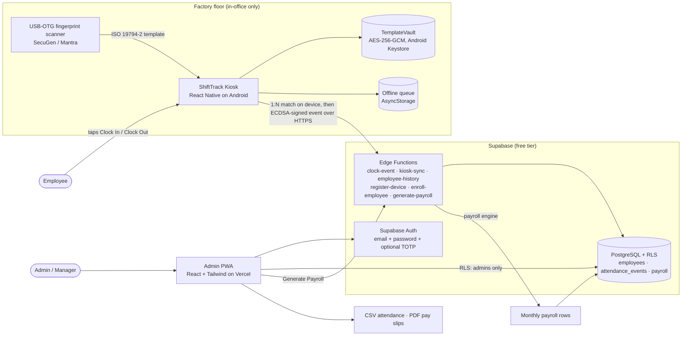
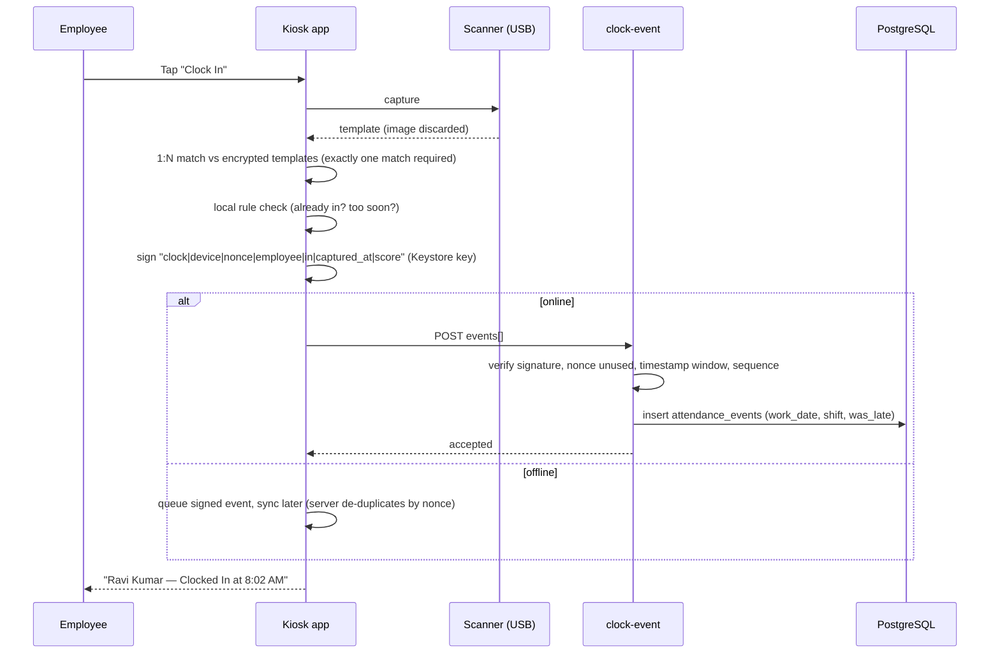
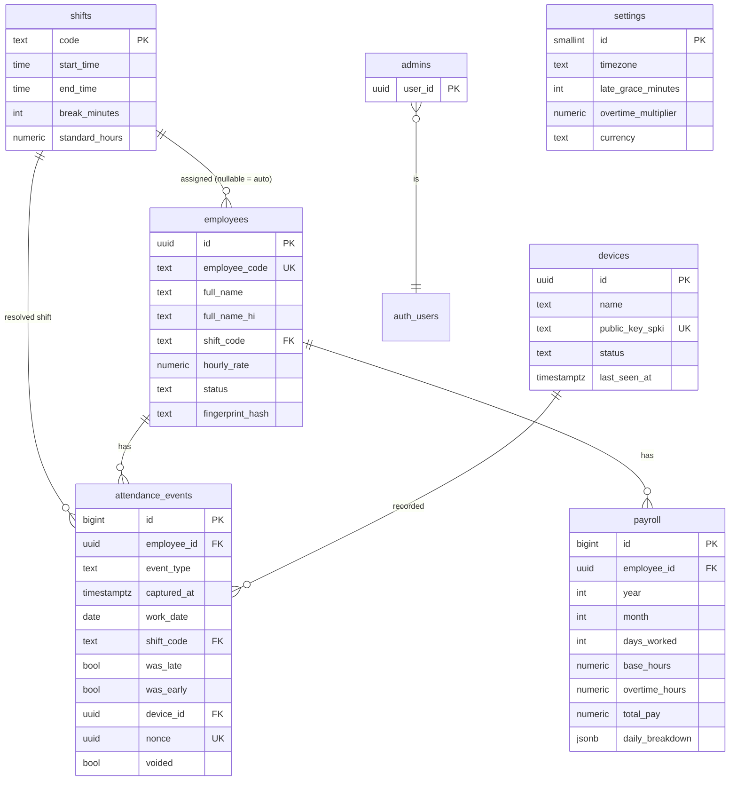

# ShiftTrack (Atteno-Sync)

Fingerprint attendance and payroll for a ~30-person factory running two shifts
(**A: 08:00–17:15**, **B: 09:00–18:15**). Employees clock in and out on an Android kiosk
with a USB fingerprint scanner at the factory. Supervisors use a web dashboard for daily
logs and monthly payroll (CSV/PDF). Everything runs on free tiers and open-source tooling.

---

## 1. System architecture



**Clock-in sequence**



### Repository layout

```
supabase/
  config.toml                         # function settings (device-signed endpoints skip gateway JWT)
  migrations/20260924000000_init.sql  # schema, indexes, triggers, RLS
  functions/
    _shared/  http.ts auth.ts config.ts shifts.ts payroll.ts payroll.test.ts
    clock-event/ kiosk-sync/ employee-history/ register-device/ enroll-employee/ generate-payroll/
kiosk/                                # React Native sources to drop into a generated RN project
  App.tsx
  src/ config.ts i18n.ts native/scanner.ts services/{api,clock,queue,store}.ts screens/*.tsx components/ui.tsx
  android/app/src/main/java/com/shifttrack/kiosk/scanner/
    ScannerDriver.kt SecuGenDriver.kt TemplateVault.kt DeviceKey.kt
    ShiftTrackScannerModule.kt ShiftTrackScannerPackage.kt
  android/app/src/main/res/xml/usb_device_filter.xml
web/                                  # Admin dashboard (Vite + React + Tailwind)
  src/ App.tsx lib/{supabase,export}.ts pages/{Login,Dashboard,Employees,Payroll,Security}.tsx
```

---

## 2. Database schema



| Table | Purpose | Key indexes |
|---|---|---|
| `settings` | Time zone, late grace (5 min), OT multiplier (1.5), currency | single row |
| `shifts` | A / B patterns; `standard_hours` (8) = base hours per day **and** daily OT threshold; `break_minutes` (75) unpaid | PK |
| `employees` | ID, code, name (+ Hindi), shift, hourly rate, active/inactive, SHA-256 of template | `employee_code` unique, `status` |
| `devices` | Paired kiosks, ECDSA P-256 public key only | `public_key_spki` unique |
| `attendance_events` | Append-only punches; corrections by voiding | `(work_date)`, `(employee_id, work_date)`, `(employee_id, captured_at desc)`, `nonce` unique |
| `payroll` | Monthly snapshot per employee incl. daily breakdown | `(employee_id, year, month)` unique, `(year, month)` |
| `admins` | Supabase Auth users allowed into the dashboard | PK |

Full DDL: [supabase/migrations/20260924000000_init.sql](supabase/migrations/20260924000000_init.sql).

---

## 3. Biometric data handling and anti-proxy controls

Fingerprint matching is fuzzy: two scans of the same finger never produce identical bytes, so a
cryptographic hash alone cannot be matched. ShiftTrack therefore splits the data:

| Data | Where | Form |
|---|---|---|
| Raw fingerprint image | Scanner → kiosk RAM only | Zeroed after template creation; never written to disk or sent |
| Minutiae template (ISO 19794-2) | Kiosk only | AES-256-GCM encrypted with a non-exportable Android Keystore key |
| Template fingerprint | Cloud (`employees.fingerprint_hash`) | SHA-256 hex, for audit of enrol/re-enrol events |
| Kiosk identity | Kiosk Keystore (private) / cloud (public) | ECDSA P-256; private key cannot leave the device |

| Threat | Control |
|---|---|
| Buddy punching (clocking for someone else) | Physical finger on the in-office scanner; 1:N match must return **exactly one** employee; the same finger cannot be enrolled for two employees |
| Phone/app used off-site | Only paired kiosks can submit; events are signed by the kiosk's Keystore key; unknown/revoked devices are rejected |
| Replay of a captured request | Unique `nonce` per event (DB unique constraint); timestamp window (+2 min / −72 h); signatures cover every field |
| Double taps / duplicate punches | 60 s minimum gap; in/out alternation enforced both on kiosk and server |
| Tampering with history | `attendance_events` is append-only (trigger); admins can only void, which is recorded with `voided_by` / `voided_at` |
| Unauthorised dashboard access | Supabase Auth, public sign-ups disabled, `admins` allow-list, RLS on every table, optional TOTP 2FA enforced in RLS and functions once enabled |
| Data in transit / at rest | HTTPS only (Supabase and Vercel terminate TLS; modern clients negotiate TLS 1.3). Supabase encrypts databases at rest. Templates never leave the kiosk |

Enable the scanner's fake-finger detection in the SDK if your model supports it.

---

## 4. Payroll formula

Implemented in [supabase/functions/_shared/payroll.ts](supabase/functions/_shared/payroll.ts) and covered by
[payroll.test.ts](supabase/functions/_shared/payroll.test.ts).

```text
For each employee-day (work_date = factory-local date of the clock-in):
  paired_minutes   = Σ (clock_out − clock_in)          over complete in/out pairs
  gap_minutes      = Σ (next clock_in − previous clock_out)   (breaks that were scanned)
  break_deduction  = max(0, shift.break_minutes − gap_minutes)
  worked_minutes   = max(0, paired_minutes − break_deduction)
  overtime_minutes = max(0, worked_minutes − shift.standard_hours × 60)

For the month:
  days_worked    = number of days with ≥ 1 complete in/out pair
  base_hours     = Σ shift.standard_hours over worked days      (= days_worked × 8)
  overtime_hours = round2( Σ overtime_minutes / 60 )
  base_pay       = base_hours × hourly_rate
  overtime_pay   = overtime_hours × hourly_rate × overtime_multiplier   (1.5)
  total_pay      = base_pay + overtime_pay
```

Days with a clock-in but no clock-out are reported as `incomplete_days` and are not paid until a
supervisor corrects them. Early departures are shown on the dashboard; per the specified formula
they do not reduce base pay.

**Example** (Shift B, rate ₹100/h): 22 worked days, 5 of them until 20:15 →
base = 22 × 8 × 100 = **₹17,600**; OT = 10 h × 100 × 1.5 = **₹1,500**; total = **₹19,100**.

---

## 5. Admin dashboard

```
┌ ShiftTrack ─ [Today] [Employees] [Payroll] [Security] ─────────────── [Sign out] ┐
│ Attendance  [ 24/09/2026 ▾ ]                                                     │
│ ┌──────────┐ ┌──────────┐ ┌──────────┐ ┌────────────┐                            │
│ │Present 27│ │Late    3 │ │Absent  3 │ │Left early 1│   ← green / orange / red   │
│ └──────────┘ └──────────┘ └──────────┘ └────────────┘                            │
│ Employee        Shift  In        Out        Status      Punches                  │
│ Ravi Kumar E01  A      8:02 am   5:20 pm    ● On time   In 8:02 · Out 5:20 remove│
│ Sunita D.  E07  B      9:14 am   Still in   ● Late      In 9:14 remove           │
│ Mohan L.   E12  A      —         —          ● Absent                             │
└──────────────────────────────────────────────────────────────────────────────────┘
Payroll tab: [ 2026-08 ▾ ] [Generate Payroll] [Payroll CSV] [Attendance CSV]
             table per employee → [Pay slip PDF]
```

- **Today**: live summary, colour-coded status, every punch with a *remove* (void) action.
- **Employees**: add/edit name, Hindi name, shift (A/B/Auto), hourly rate, active/inactive; enrolment status.
- **Payroll**: generate month, CSV export (payroll and raw attendance, UTF-8 with BOM for Excel), PDF pay slips.
- **Security**: enable TOTP 2FA (any authenticator app).

---

## 6. Deployment guide

### 6.1 Prerequisites (all free)

- Supabase account (free plan), GitHub account, Vercel account (Hobby) or Firebase Hosting / Cloudflare Pages.
- Node.js 20+, Android Studio (JDK 17 + Android SDK), [Deno](https://deno.com) (for tests).
- Hardware: one Android 8+ phone or tablet with USB-OTG, a USB fingerprint scanner (reference: SecuGen
  Hamster Pro 20; Mantra MFS100 works with a different driver class), an OTG adapter. Phones often cannot
  charge while acting as USB host; use an OTG cable with power pass-through or a tablet that supports it.

### 6.2 Backend (Supabase)

```powershell
# 1. Create a project at https://supabase.com/dashboard (region close to the factory, e.g. Mumbai).
# 2. From the repo root:
npx supabase login
npx supabase link --project-ref <your-project-ref>
npx supabase db push                      # applies supabase/migrations
npx supabase functions deploy             # deploys all functions using supabase/config.toml
npx supabase secrets set ALLOWED_ORIGIN=https://<your-admin-site>.vercel.app
```

3. **Authentication → Sign In / Providers**: turn **off** "Allow new users to sign up".
4. **Authentication → Users → Add user**: create the owner/manager account (email + strong password).
5. **SQL Editor**: grant admin and set the factory rules:

```sql
insert into public.admins (user_id) select id from auth.users where email = 'manager@yourcompany.com';
update public.settings set timezone = 'Asia/Kolkata', late_grace_minutes = 5, overtime_multiplier = 1.5, currency = 'INR';
```

6. Run the payroll tests locally: `deno test supabase/functions/_shared/payroll.test.ts`.

### 6.3 Admin dashboard (web)

```powershell
cd web
npm install
Copy-Item .env.example .env.local   # fill in Project URL and anon/publishable key (Project Settings → API)
npm run dev                          # http://localhost:5173
```

Deploy on Vercel: *New Project → import repo → Root Directory `web`* → add `VITE_SUPABASE_URL` and
`VITE_SUPABASE_ANON_KEY` → Deploy. Add the Vercel URL to **Authentication → URL Configuration** and to
`ALLOWED_ORIGIN`. Sign in, open **Security**, and enable 2FA (recommended). Add employees under **Employees**.

### 6.4 Kiosk app (Android)

1. Generate a React Native project and copy the sources:

   ```powershell
   npx @react-native-community/cli@latest init ShiftTrackKiosk
   cd ShiftTrackKiosk
   npm install @react-native-async-storage/async-storage @react-native-community/netinfo
   # copy from this repo: kiosk/App.tsx, kiosk/src/, and kiosk/android/app/src/main/{java/com/shifttrack, res/xml}
   ```

2. Fill in `src/config.ts` (Supabase URL + anon/publishable key).
3. **Scanner SDK**: register (free) on SecuGen's developer site and download *FDx SDK Pro for Android*.
   Copy its `.jar` to `android/app/libs/` and its `.so` folders (`arm64-v8a`, `armeabi-v7a`) to
   `android/app/src/main/jniLibs/`. In `android/app/build.gradle`:

   ```gradle
   dependencies {
       implementation files('libs/FDxSDKProFDAndroid.jar')   // use the exact jar name shipped in the SDK
   }
   ```

   For a different scanner, implement `ScannerDriver` with that vendor's SDK and change one line in
   `ShiftTrackScannerModule.kt`.

4. **AndroidManifest.xml** (inside `<manifest>` and the main `<activity>`):

   ```xml
   <uses-feature android:name="android.hardware.usb.host" android:required="true" />
   <!-- inside the MainActivity element -->
   <intent-filter>
       <action android:name="android.hardware.usb.action.USB_DEVICE_ATTACHED" />
   </intent-filter>
   <meta-data android:name="android.hardware.usb.action.USB_DEVICE_ATTACHED"
              android:resource="@xml/usb_device_filter" />
   ```

5. **Register the native module** in `MainApplication.kt`:

   ```kotlin
   import com.shifttrack.kiosk.scanner.ShiftTrackScannerPackage
   // ...
   override fun getPackages(): List<ReactPackage> =
       PackageList(this).packages.apply { add(ShiftTrackScannerPackage()) }
   ```

6. Build and install (sideload, no Play Store):

   ```powershell
   keytool -genkeypair -v -keystore shifttrack.keystore -alias shifttrack -keyalg RSA -keysize 2048 -validity 10000
   # configure signingConfigs.release in android/app/build.gradle (see React Native "Publishing to Google Play Store" docs)
   cd android; .\gradlew assembleRelease
   adb install app\build\outputs\apk\release\app-release.apk
   ```

7. **Prepare the kiosk device**: set time zone to the factory's and enable automatic time; connect Wi-Fi;
   Developer options → *Stay awake* while charging; Settings → Security → **App pinning** and pin ShiftTrack.
8. Plug in the scanner, tick **"Always open ShiftTrack for this device"**.
9. Long-press the **ShiftTrack** title for 3 s → sign in as admin → **Pair this kiosk** → **Enrol** each
   employee (same finger, 3 placements). Enrolment status appears on the web Employees page.

### 6.5 Operations

| Task | How |
|---|---|
| Missed clock-out | Employee clocks in next day normally; the incomplete day shows on Payroll. Void wrong punches on the Today tab. |
| New / leaving employee | Add or set *Inactive* in Employees; enrol/remove on the kiosk. |
| Lost or replaced kiosk | `update devices set status = 'revoked' where id = '...'`; pair the new kiosk and re-enrol (templates never leave the old device by design). |
| Change rates or shifts | Edit `employees.hourly_rate`, `shifts`, or `settings`; regenerate the month. |
| Backups | Free plan has no downloadable backups: export Payroll/Attendance CSV monthly and run `npx supabase db dump -f backup.sql`. |
| Free-tier pause | Supabase pauses projects inactive for 7 days; daily kiosk traffic keeps it active. |

---

## 7. Phase 2 (not implemented)

- Push reminder at 08:30 to employees not clocked in (Supabase `pg_cron` + Web Push to the admin PWA).
- Email pay slips (Supabase Edge Function + free-tier SMTP).
- Departments / skill-based rates (`departments` table, rate lookup in `generate-payroll`).
- Payroll-provider export (CSV mapping for the provider's bulk-upload format).

## License

GPL-3.0 — see [LICENSE](LICENSE).

##Supabase Password

fsj2b3Dbku3MI1JZ
